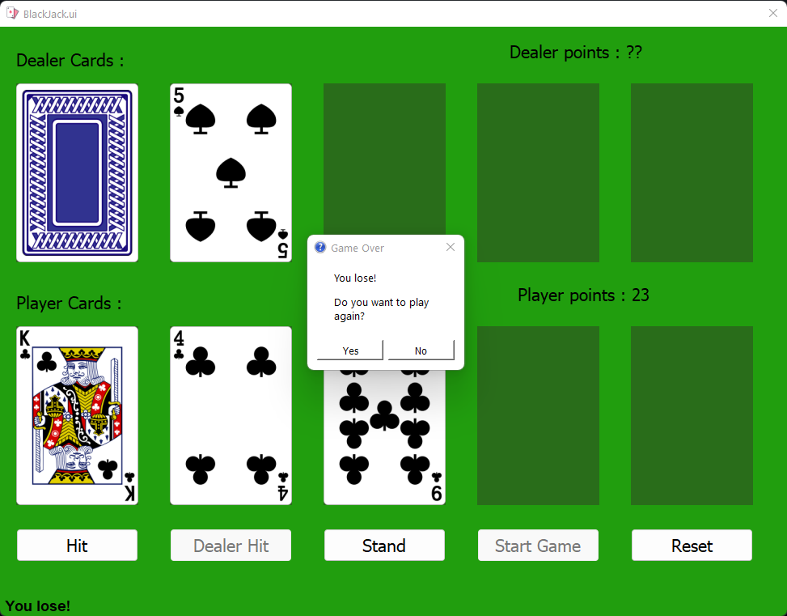

## **Card Game: BlackJack**
**BlackJack** is a famous Card game. played in all Casinos around the world, and for whom doesn't know about blackjack here's a 5 minutes **[video](https://www.youtube.com/watch?v=VB-6MvXvsKo)**, I will explain more in [**How to play**](#how-to-play)

it's a very simple game, it has lot of alogorithms to grantte the best possible outcome, you can try using my project

___
## **Table Of Contents**
- [**Card Game: BlackJack**](#card-game-blackjack)
- [**Table Of Contents**](#table-of-contents)
- [**The Goal of the Game**](#the-goal-of-the-game)
- [**Game Concepts**](#game-concepts)
- [**How The Game Works**](#how-the-game-works)
- [**Project Guideline**](#project-guideline)
- [**Future improvements**](#future-improvements)

___
## **The Goal of the Game**

Cards values:
- **Ace**: 1 or 11
- **Jack** , **Queen** , **King**: 10
- all the other cards: their value is their number

It was originally known as 21. The goal of the game is to beat the dealer's hand by scoring 21 or as close to 21 as you can get without going over. If the dealer scores closest to 21, you lose.

getting *[Ace]* and any other *[10-value_card]* is called a **blackjack**, that's where it's name comes from.

___

## **Game Concepts**

**1- Termonology**

- **Hit** - Take another card from the deck.
- **Stand** - Don't take another card, Dealer will take his turn.
- **Push** - No one wins, it's a tie.
  
**2- The Game Concept:**
  
- in my project, the player can hit as much as he wants until he busts or stands.
- once the player stands the dealer will take show all his cards and then take his turn.
- if the dealer has more points than the player, the dealer wins.
- if not he's forced to hit until he has more points than the player or loses by hitting over 21.
- getting a blackjack or scoring 21 automatically wins the game, for either player or dealer
- there's a rare calse of getting a blackjack and the dealer also has a blackjack, it's called a **push**

**3- Taking turns :**

- Each player and the dealer are gived 2 cards, from the start of the game.
- The dealer has 1 card hidden, and the player has 2 cards visible.
- The dealer covers the first card when the players Stands.
- The dealer has to play either by stading or hitting.
  
___

## **How The Game Works**

1. First you have to press the *Start Game* button to start. 
   
2. getting a blackjack on start of the game automatically wins the game, then you are forced to Restart or Close the game.
 
4. to Hit cards you have to press the **Hit** button.
5. to stand you have to press the **Stand** button.
6. once the player stands the stand button will change to **Dealer Stand**.  
7. And the dealer has to take his turn. by standing  or hitting.
8. the dealer has his own hit button which is disabled until player stands.
   
9.  wining the game is decided by the points of the player and the dealer or blackjacks. 
10. losing the game is by going over 21.
    
  
11. msg box will appear if you win or lose.
 
      
12. **yes** will restart the game, **no** will close the game.

## **Project Guideline**  

  1. QT-Designer to Create **[GUI](BlackJack.ui)**  
  2. **[BlackJack.py](BlackJack.py)** a python script that contains the game
  3. **Cards Deck** is insde **[Fonts](/fronts)** is a file modified to contain all the files above so that the game can be in 1 file project. 
  4. **[icon](/icon)**  contains icons used in project
  5. the cards are inserted in dictionaries, it's harder with all the cases the the game can be played.

---
## **Future improvements**

- Better Code documentation *[under development]*
- Change the Goal score into 31 or any other number the player enters *[under development]*
- Better MessageBoxes for the game *[under development]*
- Better end game messages *[under development]*
- Split [Blackjack.py](BlackJack.py) into more files to be easier to navigate and read.
   - use **Pygame**
- Game collection , Merge it with Cards: War and other games in the future.
- Add more features to the game (Betting, Doubling, surredering, etc.)
- Improve UI 
- AI Dealer option
- Add more players

---

